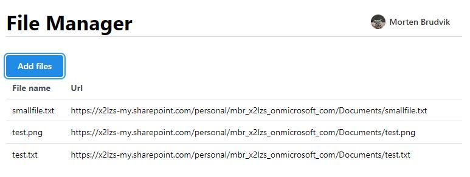
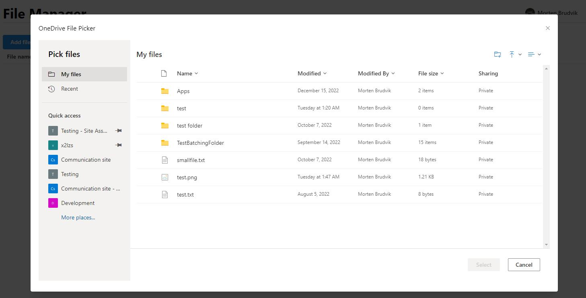

## OneDrive File Browser

Is based on the OneDrive File picker [sample](https://github.com/OneDrive/samples/tree/master/samples/file-picking) from Microsoft, 
but instead of opening up in a new browser window it's displayed inline in an IFrame. 

It uses the [Graph Toolkit](https://docs.microsoft.com/en-us/graph/toolkit/overview) Login component and MsalProvider for authentication and authorization for accessing the Graph API. 

### Setup

**Under API Permissions (Azure AD: Register app)** 
Add ``Files.Read.All``, ``Sites.Read.All``, Leave ``User.Read`` for Graph delegated permissions. 
Add ``AllSites.Read``, ``MyFiles.Read`` for SharePoint delegated permissions

NB! The below features need additional permissions that is not described in the documentation from MS.
Shared libraries (Quick access list): Add ``Sites.ReadWrite.All`` 
Your Teams (under more places): Add ``ChannelSettings.Read.All``

### Picker configuration in code

See [Schema](https://learn.microsoft.com/en-us/onedrive/developer/controls/file-pickers/v8-schema?view=odsp-graph-online) on how to configure the picker

Picker url is on the format ``{baseUrl}/_layouts/15/FilePicker.aspx``

The {baseUrl} value above is either the SharePoint web url 
``<Browser baseUrl="https://{baseurl}.sharepoint.com/" getToken={getToken} options={paramsTest} />``

## Usage
### Login
Sign in with your Microsoft account and click "Add files" to open the picker.

### Picker
Select files and click "Select" to add them to the list.

## References

#### OneDrive File Picker v8

[Samples](https://github.com/OneDrive/samples/tree/master/samples/file-picking)

[Documentation](https://learn.microsoft.com/en-us/onedrive/developer/controls/file-pickers/?view=odsp-graph-online)

#### Graph Toolkit

[GitHub](https://github.com/microsoftgraph/microsoft-graph-toolkit)

[Documentation](https://docs.microsoft.com/en-us/graph/toolkit/overview)

[Playground](https://mgt.dev/)

